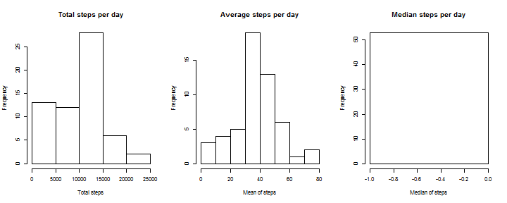
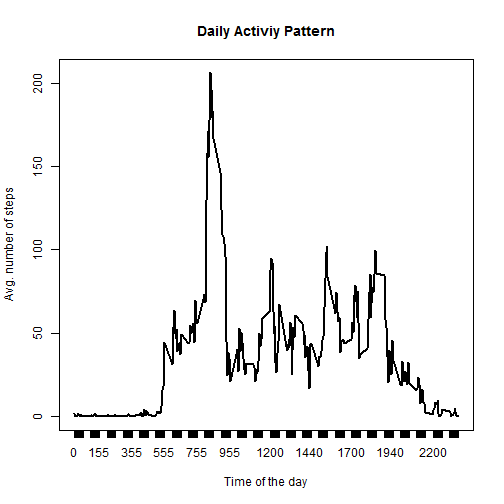
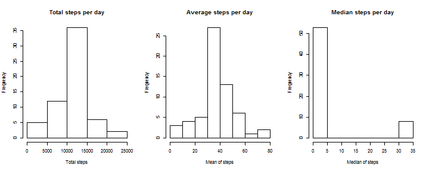
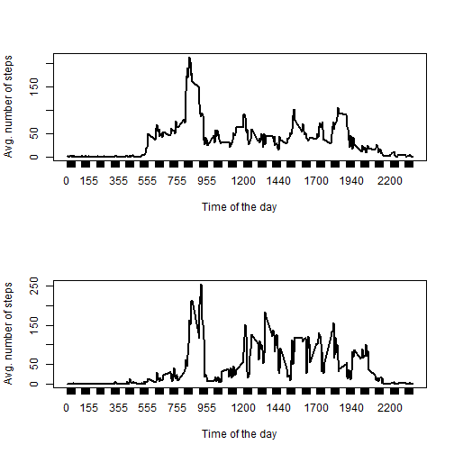

## Loading and preprocessing the data


```r
# extract zip file to "data"
dir.create("data")
```

```
## Warning in dir.create("data"): 'data' already exists
```

```r
unzip("activity.zip", exdir = "data")
# load raw data
rawData <- read.csv("data/activity.csv")
# cast "interval" as factors
rawData$interval <- as.factor(rawData$interval)
```

## What is mean total number of steps taken per day?


```r
par(mfrow = c(1, 3))

sumStepsPerDay <- tapply(rawData$steps, rawData$date, sum, na.rm = TRUE)
hist(sumStepsPerDay, main = "Total steps per day", xlab = "Total steps")

meanStepsPerDay <- tapply(rawData$steps, rawData$date, mean, na.rm = TRUE)
hist(meanStepsPerDay, main = "Average steps per day", xlab = "Mean of steps")

medianStepsPerDay <- tapply(rawData$steps, rawData$date, median, na.rm = TRUE)
hist(medianStepsPerDay, main = "Median steps per day", xlab = "Median of steps")
```

 

## What is the average daily activity pattern?


```r
avgStepsPerInterval <- xtabs(steps ~ interval, aggregate(steps ~ interval, rawData, mean))
plot(avgStepsPerInterval, type = "l", main = "Daily Activiy Pattern", xlab = "Time of the day", ylab = "Avg. number of steps")
```

 

## Imputing missing values

1. Calculate and report the total number of missing values in the dataset (i.e. the total number of rows with NAs)

```r
table(is.na(rawData$steps))[["TRUE"]]
```

```
## [1] 2304
```

2. Strategy for filling in all of the missing values in the dataset: **use the mean for that 5-minute interval.**

3. Create a new dataset that is equal to the original dataset but with the missing data filled in.


```r
# work on a copy of raw data
filledData <- rawData
# find indexes of NA values
naIndexes <- which(is.na(filledData$steps))
# replace missing values with average value for that interval
for (i in naIndexes) {
  interval <- filledData[i, 3]
  # use previously calculated contingency table
  replacement <- avgStepsPerInterval[[as.character(interval)]]
  filledData[i, 1] <- replacement
}
```

4. Updated exploratory charts:


```r
par(mfrow = c(1, 3))

sumStepsPerDay2 <- tapply(filledData$steps, filledData$date, sum)
hist(sumStepsPerDay2, main = "Total steps per day", xlab = "Total steps")

meanStepsPerDay2 <- tapply(filledData$steps, filledData$date, mean)
hist(meanStepsPerDay2, main = "Average steps per day", xlab = "Mean of steps")

medianStepsPerDay2 <- tapply(filledData$steps, filledData$date, median)
hist(medianStepsPerDay2, main = "Median steps per day", xlab = "Median of steps")
```

 

## Are there differences in activity patterns between weekdays and weekends?


```r
# Add "dayType" factor
filledData$dayType <- factor(c("weekday", "weekend"))
dates <- strptime(filledData$date, "%Y-%m-%d")
filledData$dayType <- ifelse(as.POSIXlt(dates)$wday %in% c(6, 7), "weekend", "weekday")

# calculate average per interval in weekdays
avgStepsPerIntervalWeekday <- xtabs(steps ~ interval, aggregate(steps ~ interval, filledData[filledData$dayType == "weekday", ], mean))

# calculate average per interval in weekend
avgStepsPerIntervalWeekend <- xtabs(steps ~ interval, aggregate(steps ~ interval, filledData[filledData$dayType == "weekend", ], mean))

par(mfrow = c(2, 1))

plot(avgStepsPerIntervalWeekday, type = "l", xlab = "Time of the day", ylab = "Avg. number of steps")

plot(avgStepsPerIntervalWeekend, type = "l", xlab = "Time of the day", ylab = "Avg. number of steps")
```

 
